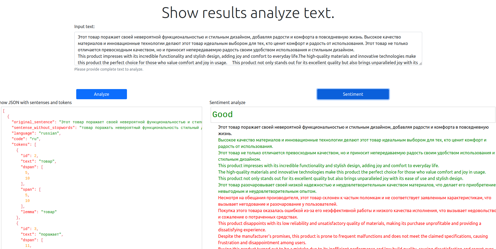
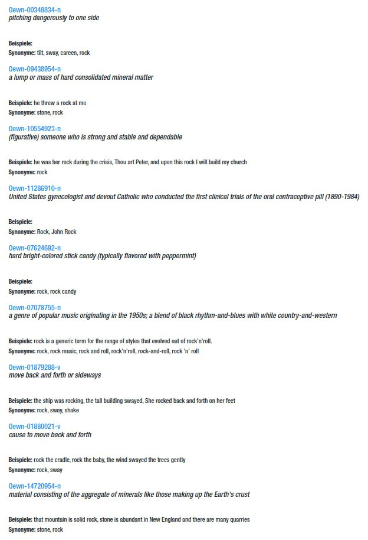

### Unfortunately, I fell ill and was unable to actively participate. Hope to catch up this week.

So the general topics in text:
1. Cleaning

We have power fool build in functions in Python like str.maketrans('', '', string.punctuation), str.replace(""", " ") or 
library re to clean and delete unimportant information
2. Language detection

langdetect supports 55 languages out of the box and this list can be added 
3. convert a string containing human language text into lists of sentences and words

Using spaCy library, we can convert string to list with detect parts of speech and morphological features
4. generate base forms of those words

we can use spaCy to make base forms ( [token.lemma_ for token in doc] )
5. detect parts of speech and morphological features

6. dependency parsing

spaCy features a fast and accurate syntactic dependency parser, and has a rich API for navigating the tree. 
7. Provide syntactic structure
8. recognize named entities
9. 30+ languages
10. have fun...

General topics in email classification and extraction:
1. Again 30+ languages
2. Diff between Categorization and classification

Categorization is a creative synthesis based on context or perceived similarity
3. Features to use

Email is also a text. So we can use the same features as SpaCy
4. Different approaches

5. Input segmentation (find the 'real' content esp. in emails

we can omit the greeting and farewell parts of the letter
6. email formats: txt, eml, msg
7. Extraction of information, general and specific ones
8. Start loving language problems 😊

General topics in Object Detection:
1. Input formats jpeg, png,etc., maybe a frame of a video
2. Sizes of input, gray, black and white, color, color space
3. Image optimization
4. Identify objects and maybe even the label (What is it)
4. Size, position maybe even angle of text on an image
5. Identify the angle, focal length, maybe even depth to 3d matrix tranform
6. Find orientation points or edges to get an angle
7. Identify single cells or maybe classify the storagebox type?
8. start looking at images from a new perspective... 😉

two examples of helpfull libs if you want to deal with html input or if you have the need for stopwords, instead of nltk: beautifulsoup4, stopwordsiso. The lego blocks that maybe have more then 80% usability out of the box. To combine things that never were combined before is also an invention. Try to focus on what you need for a specific task, don't worry to use multiple libs instead of the one magic big one
Stefan Welcker, [07.12.2023 12:11]
I believe they call this: Thinking out-of-the-box... the you get awsome functionality out-of-the-box... isn't that a funny sentence...

Stefan Welcker, [07.12.2023 12:12]
Another example is the lib Gensim, has some interesting utils for text cleaning too, sometimes the 'magic' lego blocks are found in places were no one was expecting them to be found

The last hint for today, what does dependency parsing mean? See the pic
Stefan Welcker, [07.12.2023 13:41]
more the relationship between the words, the parts are more the 'part of speeach' tags, you need to understand the word to detect the dependencies. Thats were many languages are very different

Stefan Welcker, [07.12.2023 13:42]
thats the raw basic to understand what was said, the dependencies allow to analyze what was meant

Stefan Welcker, [07.12.2023 13:43]
as some words can have different meaning. example the word 'rock' can be jsut a stone or 'she had a big rock on her finger' which may mean a diamond

Stefan Welcker, [07.12.2023 13:43]
this is called word sense disambiguation

some examples of possible meanings of the word rock taken from a wordnet

Stefan Welcker, [11.12.2023 10:38]
Reminder:
1. Write down your research result about ALL 3 challenges and let me know what type of libs you may have found and which you believe you will start with. It is clear that the final chosen ones may differ. It would be a good thing if you also list the ones you considered but decided not you use, incl. the reason
2. Decide if you prefer to work on all 3, 2 or focus on one, in parallel or in a sequence
3. Then structure your repo and have a readme per challenge were you can write down what the challenge is , your current idea how to approach a solution. 
4. It is always a good idea to keep track of decisions you made
5. Don't forget, only use service were we have control of deployment. The solution you build for customers may need to run on a bare metal k8s or maybe on AWS etc. Don't chose a SaaS API. 
6. Don't focus to much on the big bullet magic lib, go and get yourself a good 'belt full of ammunition' of libs. The combination makes a difference.
7. Think about the different stages and steps a file, txt, image, frame needs to go through to be processed, some of those stages need to be used for training and inference, if you plan to train something.
8. Have a nice monday, i will not do a final check before today 8pm CET

Stefan Welcker, [11.12.2023 10:47]
when you don't have a preferred ML/DL Lib, have a look at AutoML and AutoDL libs like Pycaret and AutoGluon, they also allow you to use MLflow. For the NLP parts, i know the languages are challenging BUT all this libs have very different quality to them, a result needs to be correct and not only easy to build or looking 'sexy'